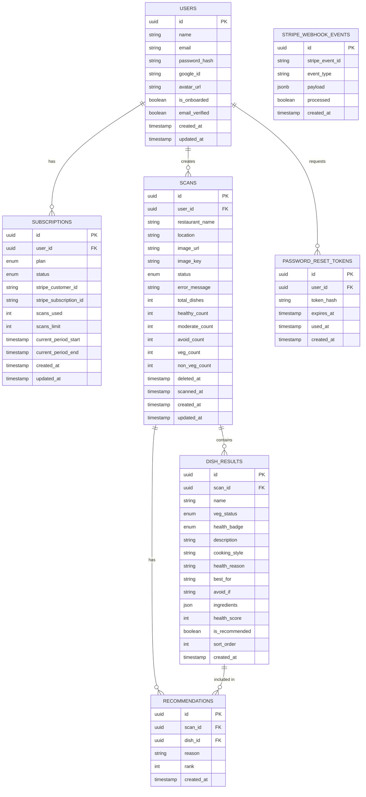

# Eatly — Complete Database Schema (MVP Phase 1)

> Derived from `mvp-plan.md` and `uiux-plan.md`. This is the source of truth for all data models.

---

## Overview

```
Users
 └── Subscriptions
 └── Scans
      └── DishResults
           └── Ingredients (JSON or separate table)
      └── Recommendations (top picks per scan)
 └── PasswordResetTokens
StripeWebhookEvents (standalone audit log)
```

---

## Entity Relationship Diagram



---

## Table Definitions

---

### 1. `users`

Stores all registered users (email/password and Google OAuth).

| Column           | Type           | Constraints                   | Description                                        |
| ---------------- | -------------- | ----------------------------- | -------------------------------------------------- |
| `id`             | `UUID`         | PK, DEFAULT gen_random_uuid() | Primary key                                        |
| `name`           | `VARCHAR(255)` | NOT NULL                      | Full display name                                  |
| `email`          | `VARCHAR(255)` | UNIQUE, NOT NULL              | Login email                                        |
| `password_hash`  | `TEXT`         | NULLABLE                      | Null if using Google OAuth only                    |
| `google_id`      | `VARCHAR(255)` | UNIQUE, NULLABLE              | Google OAuth sub ID                                |
| `avatar_url`     | `TEXT`         | NULLABLE                      | Profile picture URL                                |
| `is_onboarded`   | `BOOLEAN`      | DEFAULT false                 | Whether user has seen onboarding screen            |
| `email_verified` | `BOOLEAN`      | DEFAULT false                 | True after user confirms email (email signup only) |
| `created_at`     | `TIMESTAMP`    | DEFAULT now()                 | Account creation time                              |
| `updated_at`     | `TIMESTAMP`    | DEFAULT now()                 | Last update (auto-update via trigger)              |

**Indexes:**

- `UNIQUE INDEX` on `email`
- `UNIQUE INDEX` on `google_id`

**Notes:**

- `password_hash` is BCrypt hashed. Never store plain passwords.
- `is_onboarded` is flipped to `true` after first scan is triggered (drives Onboarding Welcome Screen).
- `email_verified` is set to `true` when user clicks the confirmation link sent at signup. Google OAuth users skip this — set to `true` automatically.

---

### 2. `subscriptions`

Manages Free/Pro plan state per user. One active subscription per user at a time.

| Column                   | Type        | Constraints   | Description                                                 |
| ------------------------ | ----------- | ------------- | ----------------------------------------------------------- |
| `id`                     | `UUID`      | PK            | Primary key                                                 |
| `user_id`                | `UUID`      | FK → users.id | Owner                                                       |
| `plan`                   | `ENUM`      | NOT NULL      | `'free'` \| `'pro'`                                         |
| `status`                 | `ENUM`      | NOT NULL      | `'active'` \| `'cancelled'` \| `'past_due'` \| `'trialing'` |
| `stripe_customer_id`     | `VARCHAR`   | NULLABLE      | Stripe customer ID (set on first upgrade attempt)           |
| `stripe_subscription_id` | `VARCHAR`   | NULLABLE      | Stripe subscription ID (set after successful payment)       |
| `scans_used`             | `INTEGER`   | DEFAULT 0     | Scans consumed this billing period                          |
| `scans_limit`            | `INTEGER`   | DEFAULT 3     | Max scans allowed (`3` for Free, `NULL`=unlimited for Pro)  |
| `current_period_start`   | `TIMESTAMP` | NULLABLE      | Billing period start (from Stripe)                          |
| `current_period_end`     | `TIMESTAMP` | NULLABLE      | Billing period end (from Stripe)                            |
| `created_at`             | `TIMESTAMP` | DEFAULT now() |                                                             |
| `updated_at`             | `TIMESTAMP` | DEFAULT now() |                                                             |

**Enum Values:**

```sql
CREATE TYPE plan_type AS ENUM ('free', 'pro');
CREATE TYPE subscription_status AS ENUM ('active', 'cancelled', 'past_due', 'trialing');
```

**Notes:**

- On signup, a `free` subscription row is auto-created for every user.
- `scans_limit = NULL` means unlimited (Pro plan).
- `scans_used` resets monthly via Stripe webhook on `invoice.paid` event.
- Used to power: Scan Limit Indicator, Upgrade Screen, Dashboard badge.

---

### 3. `scans`

Each row is one menu scan session. Stores the uploaded image, processing status, and result summary counts.

| Column            | Type           | Constraints       | Description                                             |
| ----------------- | -------------- | ----------------- | ------------------------------------------------------- |
| `id`              | `UUID`         | PK                | Primary key                                             |
| `user_id`         | `UUID`         | FK → users.id     | Owner                                                   |
| `restaurant_name` | `VARCHAR(255)` | NULLABLE          | Entered by user (optional) or auto-generated            |
| `location`        | `VARCHAR(255)` | NULLABLE          | Optional location tag                                   |
| `image_url`       | `TEXT`         | NOT NULL          | Public URL of uploaded menu image (e.g., S3/Cloudinary) |
| `image_key`       | `TEXT`         | NOT NULL          | Storage key for deletion                                |
| `status`          | `ENUM`         | DEFAULT 'pending' | Processing state (see below)                            |
| `error_message`   | `TEXT`         | NULLABLE          | Error detail if status = 'failed'                       |
| `total_dishes`    | `INTEGER`      | DEFAULT 0         | Count of dishes found                                   |
| `healthy_count`   | `INTEGER`      | DEFAULT 0         | Count of Healthy-rated dishes                           |
| `moderate_count`  | `INTEGER`      | DEFAULT 0         | Count of Moderate-rated dishes                          |
| `avoid_count`     | `INTEGER`      | DEFAULT 0         | Count of Avoid-rated dishes                             |
| `veg_count`       | `INTEGER`      | DEFAULT 0         | Count of Veg dishes                                     |
| `non_veg_count`   | `INTEGER`      | DEFAULT 0         | Count of Non-Veg dishes                                 |
| `scanned_at`      | `TIMESTAMP`    | NULLABLE          | When scan completed successfully                        |
| `created_at`      | `TIMESTAMP`    | DEFAULT now()     | When scan was initiated                                 |
| `updated_at`      | `TIMESTAMP`    | DEFAULT now()     |                                                         |

**Scan Status Enum:**

```sql
CREATE TYPE scan_status AS ENUM (
  'pending',      -- Uploaded, waiting to process
  'processing',   -- AI is currently analyzing
  'completed',    -- Done, results available
  'failed'        -- OCR/AI failed
);
```

**Indexes:**

- `INDEX` on `(user_id, created_at DESC)` — powers Scan History and Recent Scans
- `INDEX` on `(user_id, restaurant_name)` — powers Scan History **search by restaurant name**

**Notes:**

- Summary count columns (`healthy_count`, `veg_count`, etc.) are denormalized for dashboard speed — no need to count from `dish_results` every time.
- Powers: Dashboard Recent Scans preview, Scan History screen, Scan Result header summary cards.
- Scan History search uses a `ILIKE '%query%'` on `restaurant_name`. For MVP this is fine; add full-text index if needed later.

---

### 4. `dish_results`

Each row is one dish extracted from a scan. This is the core content table.

| Column           | Type           | Constraints     | Description                                                     |
| ---------------- | -------------- | --------------- | --------------------------------------------------------------- |
| `id`             | `UUID`         | PK              | Primary key                                                     |
| `scan_id`        | `UUID`         | FK → scans.id   | Parent scan                                                     |
| `name`           | `VARCHAR(255)` | NOT NULL        | Dish name as extracted from the menu                            |
| `veg_status`     | `ENUM`         | NOT NULL        | `'veg'` \| `'non_veg'` \| `'egg'` \| `'seafood'` \| `'unknown'` |
| `health_badge`   | `ENUM`         | NOT NULL        | `'healthy'` \| `'moderate'` \| `'avoid'`                        |
| `description`    | `TEXT`         | NULLABLE        | Plain English explanation of dish                               |
| `cooking_style`  | `VARCHAR(100)` | NULLABLE        | e.g., "fried", "grilled", "steamed", "baked"                    |
| `health_reason`  | `TEXT`         | NULLABLE        | Why it got its health rating                                    |
| `best_for`       | `TEXT`         | NULLABLE        | e.g., "protein diet, weight loss"                               |
| `avoid_if`       | `TEXT`         | NULLABLE        | e.g., "diabetes, weight loss"                                   |
| `ingredients`    | `JSONB`        | NULLABLE        | Array of estimated ingredient strings                           |
| `health_score`   | `SMALLINT`     | NULLABLE, 0–100 | Internal numeric score used for sorting                         |
| `is_recommended` | `BOOLEAN`      | DEFAULT false   | True if this dish is in top recommendations                     |
| `sort_order`     | `INTEGER`      | NULLABLE        | Preserves original menu order for display                       |
| `created_at`     | `TIMESTAMP`    | DEFAULT now()   |                                                                 |

**Enum Values:**

```sql
CREATE TYPE veg_status AS ENUM ('veg', 'non_veg', 'egg', 'seafood', 'unknown');
CREATE TYPE health_badge AS ENUM ('healthy', 'moderate', 'avoid');
```

**Indexes:**

- `INDEX` on `(scan_id, health_score DESC)` — powers "Healthiest first" sort
- `INDEX` on `(scan_id, veg_status)` — powers Veg/Non-veg filter
- `INDEX` on `(scan_id, health_badge)` — powers Healthy/Avoid filter

**Ingredients JSON shape:**

```json
["Rice", "Lentils", "Turmeric", "Mustard seeds", "Ghee"]
```

**Notes:**

- Powers: Scan Results screen, Dish Details screen, Filters & Sorting.
- `health_score` (0–100) is used internally for sorting. The user-facing label is `health_badge`.

---

### 5. `recommendations`

Top ranked dish picks per scan (Top 5 Healthy Picks section in results).

| Column       | Type        | Constraints          | Description                                     |
| ------------ | ----------- | -------------------- | ----------------------------------------------- |
| `id`         | `UUID`      | PK                   | Primary key                                     |
| `scan_id`    | `UUID`      | FK → scans.id        | Parent scan                                     |
| `dish_id`    | `UUID`      | FK → dish_results.id | The recommended dish                            |
| `reason`     | `TEXT`      | NOT NULL             | One-line reason (e.g., "High protein, low oil") |
| `rank`       | `SMALLINT`  | NOT NULL             | 1 = top pick, 5 = last pick                     |
| `created_at` | `TIMESTAMP` | DEFAULT now()        |                                                 |

**Unique Constraint:** `UNIQUE (scan_id, rank)` — only one dish per rank per scan.

**Notes:**

- Max 5 rows per `scan_id` for the Free plan; same for Pro in MVP.
- Powers: Top Recommendations section (Screen 9.3).

---

### 6. `password_reset_tokens`

Handles the "Forgot Password" flow on the Login screen. Tokens are short-lived and single-use.

| Column       | Type        | Constraints      | Description                                             |
| ------------ | ----------- | ---------------- | ------------------------------------------------------- |
| `id`         | `UUID`      | PK               | Primary key                                             |
| `user_id`    | `UUID`      | FK → users.id    | Owner                                                   |
| `token_hash` | `TEXT`      | UNIQUE, NOT NULL | SHA-256 hash of the reset token (never store raw token) |
| `expires_at` | `TIMESTAMP` | NOT NULL         | Typically `now() + 1 hour`                              |
| `used_at`    | `TIMESTAMP` | NULLABLE         | Set when token is consumed; prevents reuse              |
| `created_at` | `TIMESTAMP` | DEFAULT now()    |                                                         |

**Notes:**

- The raw token is emailed to the user. Only the SHA-256 hash is stored.
- On password reset request: insert a new row, invalidate old unused tokens for same `user_id`.
- On reset form submit: look up by hash, check `used_at IS NULL` and `expires_at > now()`, then set `used_at = now()` and update `users.password_hash`.
- Applies to email-signup users only. Google OAuth users cannot use this flow.

---

### 7. `stripe_webhook_events`

Audit log for Stripe webhooks. Prevents double-processing if Stripe retries an event.

| Column            | Type        | Constraints      | Description                                           |
| ----------------- | ----------- | ---------------- | ----------------------------------------------------- |
| `id`              | `UUID`      | PK               | Primary key                                           |
| `stripe_event_id` | `VARCHAR`   | UNIQUE, NOT NULL | Stripe's `evt_xxx` ID — unique per event              |
| `event_type`      | `VARCHAR`   | NOT NULL         | e.g., `invoice.paid`, `customer.subscription.deleted` |
| `payload`         | `JSONB`     | NOT NULL         | Full Stripe event JSON for debugging                  |
| `processed`       | `BOOLEAN`   | DEFAULT false    | Set to `true` after successfully handling the event   |
| `created_at`      | `TIMESTAMP` | DEFAULT now()    |                                                       |

**Notes:**

- Before processing any Stripe webhook: check `stripe_event_id` uniqueness. If already exists → skip (idempotent).
- Prevents subscription from being upgraded or reset twice on Stripe retries.
- `event_type`s to handle for MVP: `invoice.paid`, `customer.subscription.updated`, `customer.subscription.deleted`.

---

## Supporting Data / Config

These are not database tables but should be defined as application-level constants or a config table.

### Plan Limits Config

| Plan | Scans per Month | History Retention | Full Dish Details |
| ---- | --------------- | ----------------- | ----------------- |
| Free | 3               | Last 10 scans     | Basic             |
| Pro  | Unlimited       | Unlimited         | Full breakdown    |

---

## Key Business Logic Rules (Enforced at App Layer)

1. **Scan Gate:** Before creating a new scan, check `subscriptions.scans_used < scans_limit` (skip if Pro/NULL).
2. **Scan Counter:** On `scans.status` → `'completed'`, increment `subscriptions.scans_used += 1`.
3. **Onboarding Flag:** After user's first scan is created, set `users.is_onboarded = true`.
4. **Subscription Auto-Create:** On user signup, insert a `subscriptions` row with `plan = 'free'`, `scans_limit = 3`, `scans_used = 0`.
5. **Stripe Webhook Reset:** On `invoice.paid` webhook, reset `scans_used = 0` and update `current_period_start/end`.
6. **Soft Delete Scans:** When user deletes a scan, mark it deleted (add `deleted_at TIMESTAMP NULLABLE` column) rather than hard delete, to avoid orphaned dish results.

---

## SQL: Create Tables (PostgreSQL — Updated & Complete)

```sql
-- Enable UUID extension
CREATE EXTENSION IF NOT EXISTS "pgcrypto";

-- Enums
CREATE TYPE plan_type AS ENUM ('free', 'pro');
CREATE TYPE subscription_status AS ENUM ('active', 'cancelled', 'past_due', 'trialing');
CREATE TYPE scan_status AS ENUM ('pending', 'processing', 'completed', 'failed');
CREATE TYPE veg_status_type AS ENUM ('veg', 'non_veg', 'egg', 'seafood', 'unknown');
CREATE TYPE health_badge_type AS ENUM ('healthy', 'moderate', 'avoid');

-- Users
CREATE TABLE users (
  id              UUID PRIMARY KEY DEFAULT gen_random_uuid(),
  name            VARCHAR(255) NOT NULL,
  email           VARCHAR(255) UNIQUE NOT NULL,
  password_hash   TEXT,
  google_id       VARCHAR(255) UNIQUE,
  avatar_url      TEXT,
  is_onboarded    BOOLEAN NOT NULL DEFAULT false,
  email_verified  BOOLEAN NOT NULL DEFAULT false,
  created_at      TIMESTAMP NOT NULL DEFAULT now(),
  updated_at      TIMESTAMP NOT NULL DEFAULT now()
);

-- Subscriptions
CREATE TABLE subscriptions (
  id                       UUID PRIMARY KEY DEFAULT gen_random_uuid(),
  user_id                  UUID NOT NULL REFERENCES users(id) ON DELETE CASCADE,
  plan                     plan_type NOT NULL DEFAULT 'free',
  status                   subscription_status NOT NULL DEFAULT 'active',
  stripe_customer_id       VARCHAR(255),
  stripe_subscription_id   VARCHAR(255),
  scans_used               INTEGER NOT NULL DEFAULT 0,
  scans_limit              INTEGER DEFAULT 3, -- NULL = unlimited
  current_period_start     TIMESTAMP,
  current_period_end       TIMESTAMP,
  created_at               TIMESTAMP NOT NULL DEFAULT now(),
  updated_at               TIMESTAMP NOT NULL DEFAULT now()
);

-- Scans
CREATE TABLE scans (
  id               UUID PRIMARY KEY DEFAULT gen_random_uuid(),
  user_id          UUID NOT NULL REFERENCES users(id) ON DELETE CASCADE,
  restaurant_name  VARCHAR(255),
  location         VARCHAR(255),
  image_url        TEXT NOT NULL,
  image_key        TEXT NOT NULL,
  status           scan_status NOT NULL DEFAULT 'pending',
  error_message    TEXT,
  total_dishes     INTEGER NOT NULL DEFAULT 0,
  healthy_count    INTEGER NOT NULL DEFAULT 0,
  moderate_count   INTEGER NOT NULL DEFAULT 0,
  avoid_count      INTEGER NOT NULL DEFAULT 0,
  veg_count        INTEGER NOT NULL DEFAULT 0,
  non_veg_count    INTEGER NOT NULL DEFAULT 0,
  deleted_at       TIMESTAMP,
  scanned_at       TIMESTAMP,
  created_at       TIMESTAMP NOT NULL DEFAULT now(),
  updated_at       TIMESTAMP NOT NULL DEFAULT now()
);
CREATE INDEX idx_scans_user_created  ON scans(user_id, created_at DESC);
CREATE INDEX idx_scans_user_name     ON scans(user_id, restaurant_name); -- for search

-- Dish Results
CREATE TABLE dish_results (
  id              UUID PRIMARY KEY DEFAULT gen_random_uuid(),
  scan_id         UUID NOT NULL REFERENCES scans(id) ON DELETE CASCADE,
  name            VARCHAR(255) NOT NULL,
  veg_status      veg_status_type NOT NULL DEFAULT 'unknown',
  health_badge    health_badge_type NOT NULL DEFAULT 'moderate',
  description     TEXT,
  cooking_style   VARCHAR(100),
  health_reason   TEXT,
  best_for        TEXT,
  avoid_if        TEXT,
  ingredients     JSONB,
  health_score    SMALLINT CHECK (health_score BETWEEN 0 AND 100),
  is_recommended  BOOLEAN NOT NULL DEFAULT false,
  sort_order      INTEGER,
  created_at      TIMESTAMP NOT NULL DEFAULT now()
);
CREATE INDEX idx_dish_scan_health ON dish_results(scan_id, health_score DESC);
CREATE INDEX idx_dish_scan_veg    ON dish_results(scan_id, veg_status);
CREATE INDEX idx_dish_scan_badge  ON dish_results(scan_id, health_badge);

-- Recommendations
CREATE TABLE recommendations (
  id          UUID PRIMARY KEY DEFAULT gen_random_uuid(),
  scan_id     UUID NOT NULL REFERENCES scans(id) ON DELETE CASCADE,
  dish_id     UUID NOT NULL REFERENCES dish_results(id) ON DELETE CASCADE,
  reason      TEXT NOT NULL,
  rank        SMALLINT NOT NULL CHECK (rank BETWEEN 1 AND 5),
  created_at  TIMESTAMP NOT NULL DEFAULT now(),
  UNIQUE (scan_id, rank)
);

-- Password Reset Tokens
CREATE TABLE password_reset_tokens (
  id          UUID PRIMARY KEY DEFAULT gen_random_uuid(),
  user_id     UUID NOT NULL REFERENCES users(id) ON DELETE CASCADE,
  token_hash  TEXT UNIQUE NOT NULL,
  expires_at  TIMESTAMP NOT NULL,
  used_at     TIMESTAMP,
  created_at  TIMESTAMP NOT NULL DEFAULT now()
);
CREATE INDEX idx_prt_user ON password_reset_tokens(user_id);

-- Stripe Webhook Events (idempotency log)
CREATE TABLE stripe_webhook_events (
  id                UUID PRIMARY KEY DEFAULT gen_random_uuid(),
  stripe_event_id   VARCHAR(255) UNIQUE NOT NULL,
  event_type        VARCHAR(100) NOT NULL,
  payload           JSONB NOT NULL,
  processed         BOOLEAN NOT NULL DEFAULT false,
  created_at        TIMESTAMP NOT NULL DEFAULT now()
);
```

---

## Data Flow: What Gets Written When

| Event                              | Tables Written                                                                                                                                  |
| ---------------------------------- | ----------------------------------------------------------------------------------------------------------------------------------------------- |
| User signs up                      | `users` (insert) + `subscriptions` (insert free row)                                                                                            |
| User uploads menu image            | `scans` (insert, status=pending)                                                                                                                |
| AI starts processing               | `scans` (update, status=processing)                                                                                                             |
| AI completes analysis              | `dish_results` (bulk insert) + `recommendations` (insert up to 5) + `scans` (update: status=completed, counts) + `subscriptions` (scans_used++) |
| AI/OCR fails                       | `scans` (update: status=failed, error_message)                                                                                                  |
| User deletes a scan                | `scans` (update: deleted_at=now())                                                                                                              |
| User renames a scan                | `scans` (update: restaurant_name)                                                                                                               |
| User upgrades to Pro               | `subscriptions` (update: plan=pro, stripe IDs, limit=NULL)                                                                                      |
| Stripe invoice paid webhook        | `stripe_webhook_events` (insert) → `subscriptions` (update: scans_used=0, period dates)                                                         |
| User completes onboarding          | `users` (update: is_onboarded=true)                                                                                                             |
| User requests password reset       | `password_reset_tokens` (insert), old tokens for same user invalidated                                                                          |
| User submits new password          | `password_reset_tokens` (update: used_at=now()) + `users` (update: password_hash)                                                               |
| User confirms email (email signup) | `users` (update: email_verified=true)                                                                                                           |

---

## Screen ↔ Table Mapping

| Screen                    | Primary Tables Used                                                   |
| ------------------------- | --------------------------------------------------------------------- |
| Dashboard                 | `subscriptions` (scan limit), `scans` (recent 3)                      |
| Upload Menu               | `scans` (insert)                                                      |
| Processing Screen         | `scans` (poll status)                                                 |
| Scan Results              | `scans`, `dish_results`, `recommendations`                            |
| Dish Details              | `dish_results` (single row)                                           |
| Scan History              | `scans` (list + `ILIKE` search on `restaurant_name`)                  |
| Upgrade / Paywall         | `subscriptions` (plan, scans_used, scans_limit)                       |
| Profile / Account         | `users`, `subscriptions`                                              |
| Sign Up (email)           | `users` (insert) → email sent with verification token                 |
| Login → Forgot Password   | `password_reset_tokens` (insert/validate) + `users` (password update) |
| Payment / Stripe Webhooks | `stripe_webhook_events` (idempotency) + `subscriptions` (update)      |

---

## Recommended Tech Stack for DB Layer

| Layer        | Recommendation                                     |
| ------------ | -------------------------------------------------- |
| Database     | **PostgreSQL** (via Supabase or Railway for MVP)   |
| ORM          | **Prisma** (type-safe, great DX)                   |
| File Storage | **Cloudinary** or **AWS S3** (for menu images)     |
| Auth         | **Supabase Auth** or **NextAuth** (Google + Email) |
| Payments     | **Stripe** (Checkout + Billing Portal + Webhooks)  |
